# VibeTrade — Cursor for Day Traders

VibeTrade is a real-time BTC trading terminal powered by an agentic LLM, live market data, and a voice-first interaction pipeline. It ingests multiple data streams, computes a risk score every second, and uses a LangGraph agent to inspect market conditions, analyze sentiment, and execute paper trades through Alpaca. 

<p align="center">
  
</p>

## What it does

* Streams **live BTC price** from Alpaca
* Ingests **Reddit sentiment**, **Polymarket odds**, and **historical context**
* Periodically computes a **risk score/hype score** using a weighted formula
* Runs a **LangGraph tool-calling agent** capable of:
  * Reading market sentiment
  * Inspecting portfolio & open orders
  * Executing Alpaca paper trades via structured tool calls
  * Locking the user’s account during high-risk situations
* Provides real-time **voice interaction** through ElevenLabs STT + TTS
* Renders a real-time dashboard with TradingView charts, order tables, and risk monitors

Everything updates live via WebSockets:
voice → STT → LLM → TTS,
market data → frontend,
agent decisions → frontend,
orders → portfolio panel.

<p align="center">
  
</p>


## **How it works**

### **Frontend (Next.js + TailwindCSS)**

* Trading dashboard with TradingView charts
* Live BTC price + risk monitor
* Polymarket + Reddit sentiment panels
* Voice capture + streaming
* Real-time UI updates from Supabase + WebSockets

### **Backend (FastAPI)**

* WebSocket manager for:

  * Voice streaming
  * Agent messages
  * Interrupts & alerts
* Alpaca trading service (market, limit, stop)
* Data ingestion workers:
  * Reddit + Polymarket + price → sentiment + summary
  * Risk score computation + system alerts
* Interrupt workers:
  * Monitor current sentiment/prices → send interruptions to the agent in case of anomalous actions
* Supabase storage for:
  * Market context
  * Orders & portfolio
  * Feed items
  


### Agent Layer (LangGraph)

Some tools implemented:

* `get_market_sentiment()`
* `list_holdings()`
* `execute_trade()`
* `lock_user_account()` — locks trading endpoints to prevent panic trading

Voice:

* ElevenLabs STT (input)
* ElevenLabs V3 TTS (output with emotion tags)


## Tech Stack

**Frontend**

* Next.js, React
* TailwindCSS
* TradingView Charts
* WebSockets

**Backend**

* FastAPI
* Alpaca Market Data + Paper Trading
* Polymarket + Reddit JSON
* Supabase (Postgres)

**AI Layer**

* LangGraph (state machine)
* OpenAI for tool-calling & analysis
* ElevenLabs real-time STT/TTS

```mermaid
%%{init: {'theme':'base', 'themeVariables': { 'edgeLabelBackground':'#ffffff', 'primaryColor':'#ffffff', 'lineColor':'#000000'}}}%%
graph TB
    subgraph ext["External Data Sources"]
        FINN["Finnhub WebSocket<br/>Live BTC prices + trades<br/>4-second bar aggregation"]
        PM["Polymarket API<br/>Prediction markets & odds"]
        RD["Reddit JSON<br/>Social sentiment scraping"]
        ALPACA["Alpaca Paper Trading<br/>Orders & positions API"]
    end

    subgraph workers["Background Workers"]
        DI["Data Ingest Worker<br/>Runs every 10 minutes<br/>Fetches all external data"]
        TM["Trigger Monitor<br/>Runs every 1 second<br/>Calculates risk score"]
        AW["Anomaly Worker<br/>Runs every 5 seconds<br/>Crash/moon detection"]
    end

    subgraph services["Core Services"]
        FINN_SVC["Finnhub Service<br/>• Live price cache<br/>• Trade aggregation<br/>• Crash/moon injection<br/>• Price override system"]
        ALPACA_SVC["Alpaca Trading Service<br/>• Place orders<br/>• Get positions<br/>• Cancel orders<br/>• Account balance"]
        ANOM_SVC["Anomaly Monitor<br/>• Z-score detection<br/>• Rate of change analysis<br/>• Trend break detection<br/>• Statistical modeling"]
        PM_SVC["Polymarket Service<br/>• Fetch markets<br/>• Parse odds & volume"]
        RD_SVC["Reddit Service<br/>• Scrape posts<br/>• Sentiment analysis"]
        VOICE_SVC["Voice Session Manager<br/>• ElevenLabs STT/TTS<br/>• Session management<br/>• Interrupt handling"]
        OAI["OpenAI Service<br/>• GPT-4o-mini (data processing)<br/>• GPT-4o (agent brain)"]
    end

    subgraph db["Database (Supabase)"]
        DB_MC[("market_context<br/>Time-series data<br/>Risk scores & sentiment")]
        DB_FI[("feed_items<br/>Polymarket + Reddit<br/>UI display data")]
        DB_P[("portfolio<br/>Balance & lock status")]
        DB_T[("trades<br/>Orders & history")]
    end

    subgraph api["API Layer (FastAPI)"]
        REST["REST Endpoints<br/>/api/portfolio<br/>/api/orders<br/>/api/polymarket<br/>/api/reddit<br/>/api/vibes"]
        WS_AGENT["Voice WebSocket<br/>/ws/voice/agent<br/>Bidirectional voice chat"]
        WS_MARKET["Market WebSocket<br/>/ws/crypto<br/>Live price streaming"]
        AGENT["LangGraph Agent<br/>• get_market_sentiment()<br/>• list_holdings()<br/>• execute_trade()<br/>• lock_user_account()"]
    end

    subgraph frontend["Frontend (Next.js + React)"]
        UI_CHART["Live Price Charts<br/>TradingView Lightweight Charts"]
        UI_TRADE["Trading Panel<br/>BUY/SELL interface"]
        UI_PORT["Portfolio Panel<br/>Positions + active orders"]
        UI_HIST["History Panel<br/>Closed trades + P&L"]
        UI_POLY["Polymarket Feed<br/>Live prediction odds"]
        UI_RED["Reddit Feed<br/>Sentiment posts"]
        UI_AGENT["Voice Agent<br/>VRM avatar + transcript"]
        UI_RISK["Risk Meter<br/>0-100 danger gauge"]
    end

    %% Data Flow: External Sources → Services
    FINN -->|WebSocket stream| FINN_SVC
    FINN_SVC -->|Price updates| DI
    PM -->|API fetch| PM_SVC
    PM_SVC -->|Markets data| DI
    RD -->|JSON scrape| RD_SVC
    RD_SVC -->|Posts data| DI
    ALPACA -->|REST API| ALPACA_SVC

    %% Workers → Database
    DI -->|Write market context<br/>sentiment, prices, hype| DB_MC
    DI -->|Write feed items<br/>Polymarket + Reddit| DB_FI
    TM -->|Read latest context| DB_MC
    TM -->|Update risk score| DB_MC
    AW -->|Monitor portfolio| DB_P
    AW -->|Check BTC price| FINN_SVC
    AW -->|Analyze anomalies| ANOM_SVC

    %% Crash/Moon Detection Flow
    AW -->|Detect crash/moon<br/>BTC < $60k or > $100k| VOICE_SVC
    VOICE_SVC -->|Speak alert| WS_AGENT
    FINN_SVC -->|Price override<br/>Simulate crash/moon| WS_MARKET

    %% Trigger Monitor → Alert Flow
    TM -->|Risk score > 80| WS_AGENT
    TM -->|Generate alert text| OAI

    %% REST API → Database
    REST -->|Read/write| DB_P
    REST -->|Read/write| DB_T
    REST -->|Read| DB_MC
    REST -->|Read| DB_FI
    REST -->|Place orders| ALPACA_SVC
    REST -->|Get positions| ALPACA_SVC

    %% Agent Tools → Database
    AGENT -->|Read sentiment| DB_MC
    AGENT -->|Read portfolio/orders| DB_P
    AGENT -->|Read trades| DB_T
    AGENT -->|Write pending trade| DB_T
    AGENT -->|Lock account| DB_P

    %% Voice WebSocket Flow
    UI_AGENT -->|User voice audio| WS_AGENT
    WS_AGENT -->|Audio chunks| VOICE_SVC
    VOICE_SVC -->|Transcribe STT| OAI
    WS_AGENT -->|User text| AGENT
    AGENT -->|Generate response| OAI
    AGENT -->|Response text| VOICE_SVC
    VOICE_SVC -->|TTS audio| WS_AGENT
    WS_AGENT -->|Agent audio| UI_AGENT

    %% Market WebSocket Flow
    FINN_SVC -->|Live prices<br/>4-second bars| WS_MARKET
    WS_MARKET -->|Price updates| UI_CHART

    %% REST → Frontend
    REST -->|Portfolio data| UI_PORT
    REST -->|Orders data| UI_PORT
    REST -->|Trade history| UI_HIST
    REST -->|Polymarket markets| UI_POLY
    REST -->|Reddit posts| UI_RED
    REST -->|Risk score + vibes| UI_RISK

    %% Trading Flow
    UI_TRADE -->|Manual order| REST
    REST -->|Execute via Alpaca| ALPACA_SVC
    ALPACA_SVC -->|Order confirmation| DB_T

    %% Agent Trading Flow (with approval)
    AGENT -->|Propose trade| WS_AGENT
    WS_AGENT -->|Approval request| UI_AGENT
    UI_AGENT -->|User confirms/denies| WS_AGENT
    WS_AGENT -->|Resume agent| AGENT
    AGENT -->|Execute if approved| ALPACA_SVC

    %% Styling with vibrant colors for nodes
    classDef external fill:#ff6b6b,stroke:#c92a2a,stroke-width:3px,color:#fff
    classDef worker fill:#20c997,stroke:#0ca678,stroke-width:3px,color:#fff
    classDef service fill:#a29bfe,stroke:#6c5ce7,stroke-width:3px,color:#fff
    classDef db fill:#ffd93d,stroke:#f8b500,stroke-width:3px,color:#000
    classDef api fill:#48dbfb,stroke:#0abde3,stroke-width:3px,color:#000
    classDef frontend fill:#ff6348,stroke:#e84118,stroke-width:3px,color:#fff

    %% Styling for subgraph backgrounds
    classDef extBg fill:#ffe0e0,stroke:#ff6b6b,stroke-width:4px,color:#000
    classDef workerBg fill:#d4f4e8,stroke:#20c997,stroke-width:4px,color:#000
    classDef serviceBg fill:#e8e4fc,stroke:#a29bfe,stroke-width:4px,color:#000
    classDef dbBg fill:#fff9e0,stroke:#ffd93d,stroke-width:4px,color:#000
    classDef apiBg fill:#e0f5ff,stroke:#48dbfb,stroke-width:4px,color:#000
    classDef frontendBg fill:#ffe5e0,stroke:#ff6348,stroke-width:4px,color:#000

    class FINN,PM,RD,ALPACA external
    class DI,TM,AW worker
    class FINN_SVC,ALPACA_SVC,ANOM_SVC,PM_SVC,RD_SVC,VOICE_SVC,OAI service
    class DB_MC,DB_FI,DB_P,DB_T db
    class REST,WS_AGENT,WS_MARKET,AGENT api
    class UI_CHART,UI_TRADE,UI_PORT,UI_HIST,UI_POLY,UI_RED,UI_AGENT,UI_RISK frontend

    class ext extBg
    class workers workerBg
    class services serviceBg
    class db dbBg
    class api apiBg
    class frontend frontendBg
```




## Running locally

```
cd frontend
npm install
npm run dev
```

```
cd backend-new
pip install -r requirements.txt
uvicorn app.main:app --reload
```

Required env vars for backend:

```
# Supabase
SUPABASE_URL=
SUPABASE_ANON_KEY=REPLACE_WITH_SUPABASE_ANON_KEY
SUPABASE_SERVICE_KEY=REPLACE_WITH_SUPABASE_SERVICE_KEY

# OpenAI (for agent LLM + data processing)
OPENAI_API_KEY=REPLACE_WITH_OPENAI_API_KEY

# ElevenLabs
ELEVENLABS_API_KEY=REPLACE_WITH_ELEVENLABS_API_KEY
ELEVENLABS_VOICE_ID=REPLACE_WITH_ELEVENLABS_VOICE_ID

# Server Config
HOST=0.0.0.0
PORT=8000
ENVIRONMENT=development

# Demo Mode
ENABLE_CRASH_BUTTON=true

# Alpaca Market Data (required for live charts)
# Sign up at https://alpaca.markets/ for paper trading API keys
ALPACA_API_KEY=REPLACE_WITH_ALPACA_API_KEY
ALPACA_SECRET_KEY=REPLACE_WITH_ALPACA_SECRET_KEY
ALPACA_BASE_URL=https://paper-api.alpaca.markets/v2

# finnhub
FINNHUB_API_KEY=REPLACE_WITH_FINNHUB_API_KEY
```

For frontend:

```
NEXT_PUBLIC_API_URL=http://localhost:8000
```


## Other demo features

* pressing '-' makes a request for the backend to simulate a "crash", causing the agent to respond in real-time to protect your trades
* pressing '=' makes a request for the backend to simulate a "moon", causing the agent to respond in real-time to take advantage
* pressing '\' resets this behavior


## Status

* This is a single user MVP built for Hack Western 12
* Not production-ready
* Pretty much all features however **do actually work** end-to-end


 
